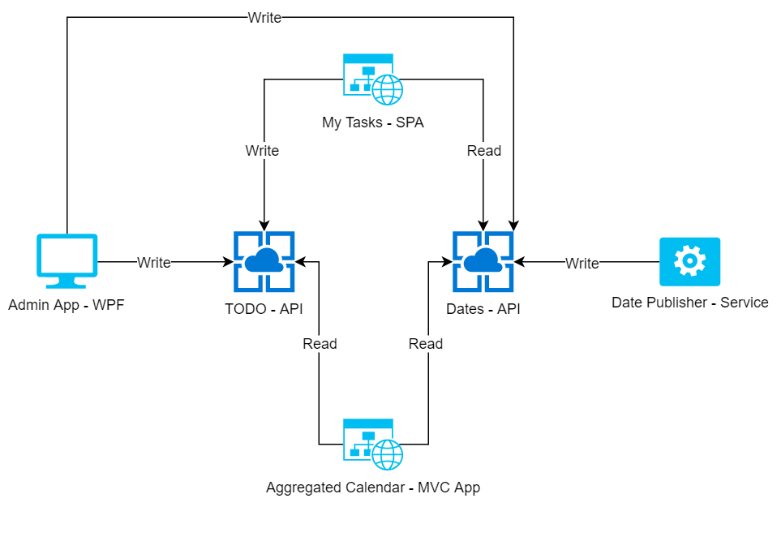

# KMD Logic Identity Examples

## Overview

The purpose of these examples is to demonstrate how Logic Identity can be used to authenticate and authorize a variety of application types. They are intended to be used as starting examples of how to approach authentication/authorization, not as production-grade applications. They explore a number of different scenarios including which OpenID Connect/OAuth2 flow to use for specific application types, and how to lock down API access at the application level using OAuth Scopes contained in JWT bearer tokens.

Each project in the solution corresponds to an architectural piece in the following diagram



* TODO is an API that allows each user to maintain a private list of TODO items which have a date and description
* Dates is an API that publishes global dates of interest to all users
* My Tasks is a Single Page Application (React) that has Read/Write access to TODO API and Read access to Dates API
* Date Publisher is a Service that periodically publishes new dates via Write access to the Dates API
* Aggregated Calendar is a Razor Pages `asp.net` server app that obtains date information from both APIs, including user-specific dates, and displays it in an aggregated format. It has Read access to both TODO API and Dates API.
* Admin App is a WPF app that has Read/Write/Admin access to TODO API and Read/Write access to Dates API

## Logic Identity application registrations

### APIs
#### Details
```
ApplicationId: 507a4976-d839-47a3-b022-85cefe1b005d
```

Both APIs are considered to be owned by a single product. They are grouped under a single Logic Identity application registration, which means they both validate the same audience value in access tokens.

To limit API access per-application a number of scopes have been defined:

* dates.read - read access to the Dates API
* dates.write - write access to the Dates API
* todos.read - read access to the Todos API
* todos.write - write access to the Todos API
* todos.admin - admin access to the Todos API

<hr/>

### Date Publisher
#### Details
```
ApplicationId: 2fac1739-a06d-452d-a67e-d185c240241e
Secret: Contact discover@kmdlogic.io if you are interested in running this locally
Scopes: dates.read, dates.write
```

The date publishing service uses Client Credentials flow to programmatically obtain an access token for calling the Dates API. Client Credentials are used when there is no interactive user during login. These types of applications are typically tightly controlled and are considered secure, therefore a secret is involved in obtaining an access token.

<hr/>

### My Tasks
#### Details
```
ApplicationId: 25d9efa3-9ec1-4e2a-805d-ca5fefee7731
Scopes: dates.read, todos.read, todos.write
```
The My Tasks SPA uses OpenId Connect Implicit flow, which simultaneously logs the user in and obtains an access token in a single call to Logic Identity. Because a SPA is public and easily reverse-engineered, no secrets are involved.

<hr/>

### Aggregated Calendar
#### Details
```
ApplicationId: 8abf69c7-b780-4b98-a3e1-f86cc64a81be
Secret: Contact discover@kmdlogic.io if you are interested in running this locally
Scopes: dates.read, todos.read
```
The Aggregated Calendar ASP.NET server app uses OpenId Connect Authorization Code flow, which logs the user in and returns a short-lived code that is redeemed for an access token and refresh token. Because the code redemption takes place on a secure server a secret is used. Also, refresh tokens for the user can be obtained and stored on the server so that their access token can be renewed silently after it expires.

<hr/>

### Admin App
#### Details
```
ApplicationId: 68bf6751-9bdd-44ed-b060-d1b039fb1c75
Scopes: dates.read, dates.write, todos.read, todos.write, todos.admin
```
The Admin App WPF app uses [MSAL](https://docs.microsoft.com/en-us/azure/active-directory/develop/msal-overview) to manage interactive user login. MSAL takes care of displaying an in-app popup that hosts the browser for login. It also uses OpenId Connect Authorization Code flow, which logs the user in and returns a short-lived code that is redeemed for an access token and refresh token. 

Because the WPF app is deployable to any user's computer and can be decompiled, it is considered insecure and so no secret is used when redeeming codes for tokens. However refresh tokens for the user can still be obtained and stored in an encrypted local token cache, which allows for access tokens to be renewed silently after they expire.

Note that the Admin App also has a special scope assigned to it, `todos.admin`, which allows it to query the TODOs of all users.

## Running the examples locally

Prerequisites:

* [.NET Core 2.2 SDK](https://dotnet.microsoft.com/download) is required to build and run most of the examples
* [.NET Framework 4.5.2](https://dotnet.microsoft.com/download) or later is required to build and run the Admin App WPF app
* [Node.js](https://nodejs.org/en/) is required to build and run My Tasks SPA
* A KMD user account is required to successfully login
* Some of the applications require secrets - contact [discover@kmdlogic.io](mailto:discover@kmdlogic.io) if you are interested in running them locally

Before running the solution for the first time, it is necessary to install npm modules (once only):
1. Open a command shell at `Kmd.Logic.Identity.Examples.MyTasks\ClientApp`
2. Run `npm install`

To build and run the solution:

1. Open the solution in Visual Studio 2019
2. In Solution Explorer, right-click on the solution and select `Set Startup Projects...`
3. Choose `Multiple startup projects`
4. For each project in the solution, set the `Action` to `Start`
5. Click `Apply` and close the dialog
6. Build the project
7. Hit `F5` to run

The `launchSettings.json` files have been set to start each web application on a specific port using https.  You may be prompted to trust the development SSL certificate, which you should accept. The specific ports for each web application are:

* Dates API - https://localhost:44327
* TODO API - https://localhost:44328
* My Tasks - https://localhost:44326
* Aggregated Calendar - https://localhost:44325

It is important that the web applications stick to using these allocated ports because the reply urls have been registered in Logic Identity.  If the apps don't start on these ports login will fail when attempting to return after signing in. If login isn't working, check to make sure the apps are starting on the correct local ports and are using https.

If everything works, the following will happen:

1. Four web applications will start (note that the React SPA can take a while to start due to webpack compilation)
2. You browser should automatically open tabs for My Tasks and Aggregated Calendar, but the two APIs have been set to not open tabs since they require access tokens
3. The Date Publisher console app will start and publish a randomly selected date every 10 seconds
4. The WPF Admin App will open

## Using the applications

All apps that require interactive login have been configured to use KMD ADFS as the only authentication option.  Triggering a login process will display the KMD ADFS login page where you can login using you KMD credentials.

* Use the My Tasks app to create new TODO items for your specific user. You can also view the list of globally published dates.
* Use the Aggregated Calendar app to view a consolidated view of your user-specific TODOs and the globally published dates.
* Use the Admin App to:
    * View the TODOs for all users
    * Delete the TOODs for a specific user by entering the userId and clicking delete
    * View the globally published dates
    * Delete all globally published dates

## Points of interest

The My Tasks SPA is using [oidc-client](https://github.com/IdentityModel/oidc-client-js) to manage the login process. The client library enforces all of the important login steps, including: generating a nonce; downloading openid configuration data; validating tokens; storing tokens in the user's browser session etc. Using a pre-built and battle-tested open-source library for these tasks is __highly recommended__ over rolling your own login library.

Both APIs use SQLite for persisting data across app restarts.

Adding JWT bearer authentication to an API is easily accomplished using the `Microsoft.AspNetCore.Authentication.AzureADB2C.UI` nuget package.  Inspect the `Startup.cs` files for the APIs to see how this is done.

Adding authorization to API routes using scopes in the JWT bearer token is easily accomplished by registering some custom authorization policies. For a good read on how to do this, check out [Auth0's guide](https://auth0.com/docs/quickstart/backend/aspnet-core-webapi/01-authorization).

The mechanism for storing access and refresh tokens in the Aggregated Calendar app is just for reference and is not robust (it doesn't survive application restarts).  For a real application, a better mechanism would be required - for example, using Azure Key Vault for storing the refresh token and also using a distributed cache (e.g. Redis) to hold access tokens for users.